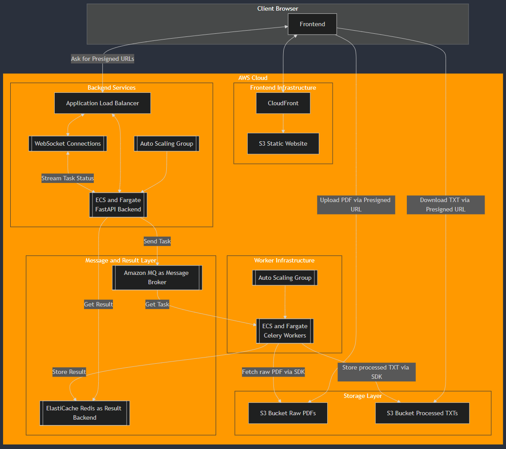

# Local Setup Instructions

I want to start by apologizing for requiring you to use an outdated version of my code to run it locally. The latest version in the main branch is designed to work with AWS S3, and I didn’t initially intend for the run-locally branch to be used by anyone. I added S3 shortly after, and so the run-locally branch has since become old and somewhat ‘dirty.’ However, if you prefer not to add your own AWS credentials, the run-locally branch is the only option for running the code locally without them.

The main branch, though, is fully runnable locally by simply adding AWS credentials to the .env file, and it reflects the intended, up-to-date version. If you review my code, I’d greatly appreciate it if you could focus on the main branch. During the presentation, I’d be more than happy to demonstrate the S3 functionality using my own credentials if that would be helpful.

Follow these steps to run the application locally using the 'run-locally' branch. In case you want to use the 'main' branch, you won't need to switch the branch and you will have to add the required credentials to the .env file:

1. **Clone the repository**:
   ```bash
   git clone [repository-url]
   cd [repository-name]
   ```

2. **Switch to the `run-locally` branch**:
   ```bash
   git checkout run-locally
   ```

3. **Rename '.env.sample' to '.env'**:

4. **Start the application**:
   ```bash
   docker-compose up --build --scale worker=2
   ```
   
5. **Access the application**:
   - Open `frontend/index.html` in your web browser.

6. **Use the application**

## Cloud Architecture

Below is a diagram of the cloud architecture for this application:



**Note:** Currently, only the S3 service has been implemented in the actual application. The other AWS services shown in the diagram represent the ideal architecture for future development and are not yet integrated into the current version of the application.

